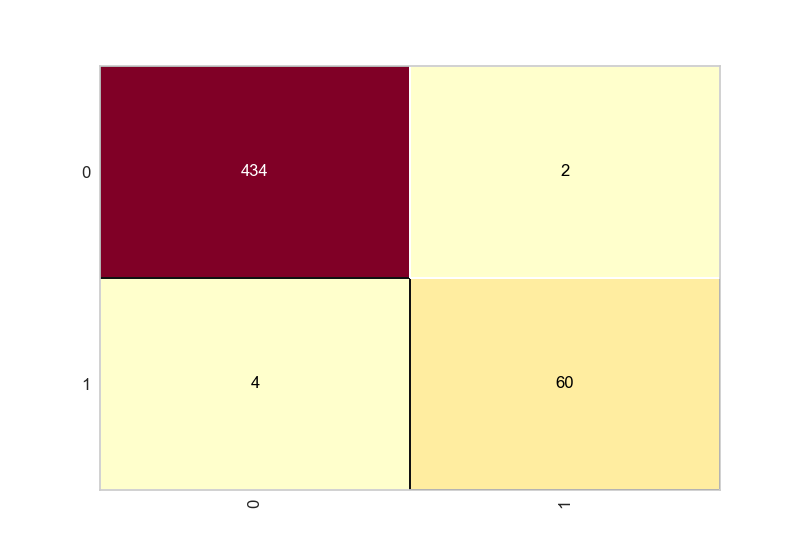
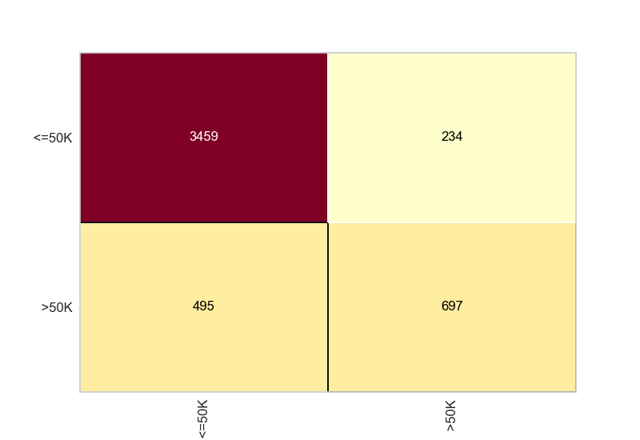

# 💳📊 SVM Classifier: Risco de Crédito & Análise Censitária

[](https://www.python.org/)
[](https://pandas.pydata.org/)
[](https://numpy.org/)
[](https://scikit-learn.org/stable/modules/svm.html)
[](https://scikit-learn.org/stable/)
[](https://www.scikit-yb.org/)
[](https://matplotlib.org/)
[](https://docs.python.org/3/library/pickle.html)
## 🧠 Sobre o Projeto

Este projeto explora o uso de **Support Vector Machines (SVM)** para classificar dados de risco de crédito e dados do censo, demonstrando habilidades fundamentais em machine learning supervisionado, avaliação de desempenho e visualização de resultados com bibliotecas modernas em Python.

---

## 📁 Conjuntos de Dados Utilizados

- **Risco de Crédito** (`credit.pkl`): Dados anonimizados com variáveis financeiras para prever bom/mau pagador.
- **Censo** (`census.pkl`): Base populacional para prever a faixa salarial de indivíduos (≤50K ou >50K).

---

## ⚙️ Técnicas Utilizadas

- **Modelagem com SVM (Support Vector Machine)**
  - Kernel RBF para o modelo de crédito
  - Kernel Linear para o modelo censitário
- **Avaliação com:**
  - Acurácia
  - Matriz de Confusão (`yellowbrick`)
  - Relatório de classificação (`precision`, `recall`, `f1-score`)

---
#### Modelo de Crédito:

* Kernel: `rbf`
* Acurácia: `[0.988]`



 **classification_report_ credit**

               precision    recall  f1-score   support

           0       0.99      1.00      0.99       436
           1       0.97      0.94      0.95        64

    accuracy                           0.99       500
   macro avg       0.98      0.97      0.97       500
weighted avg       0.99      0.99      0.99       500


#### Modelo Census:

* Kernel: `linear`
* Acurácia: `[0.850]`



 **classification_report_ census**
 
               precision    recall  f1-score   support

       <=50K       0.87      0.94      0.90      3693
        >50K       0.75      0.58      0.66      1192

    accuracy                           0.85      4885
   macro avg       0.81      0.76      0.78      4885
weighted avg       0.84      0.85      0.84      4885


---

## 📦 Estrutura do Projeto

```bash
.
├── census.pkl
├── confusion_matrix_census.png
├── confusion_matrix_credit_svm.png
├── credit.pkl
├── README.md
├── requirements.txt
├── svm.ipynb
├── svm.py


```

## 🖥️ Como Executar

1. Clone o repositório:
   ```bash
   git clone https://github.com/seu-usuario/nome-do-repositorio.git
   cd nome-do-repositorio
   ```

2. Crie o ambiente virtual (opcional mas recomendado):
   ```bash
   python -m venv venv
   source venv/bin/activate  # Linux/Mac
   .\venv\Scripts\activate    # Windows
   ```

3. Instale as dependências:
   ```bash
   pip install -r requirements.txt
   ```

4. Execute o script:
   ```bash
   python svm.py
   ```

---

## 📚 Requisitos

Veja o `requirements.txt` para a lista completa, mas os principais são:

- `scikit-learn`
- `yellowbrick`
- `pandas`
- `numpy`
- `matplotlib`

---

## 👨‍💻 Quem Desenvolveu

Projeto desenvolvido por:

**Daniel Campos Coelho**  
🎓 Estudante de Ciências da Computação  
🔗 [LinkedIn](https://www.linkedin.com/in/daniel-coelho-818381293/)  
💻 [GitHub](https://github.com/daccoelho)

---

## ✨ Contribuições

Contribuições são muito bem-vindas! Sinta-se à vontade para fazer um fork, abrir uma issue ou mandar um pull request.

---
